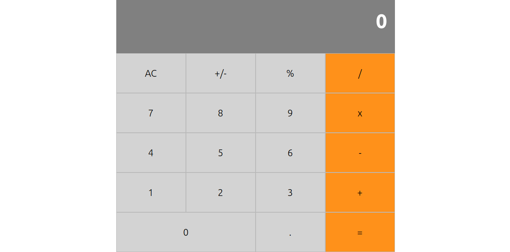

## Calculator app
- The project was about a calculator that was built in react.

[Live link](https://friendly-kilby-083c54.netlify.com/)

## Authors
- Fatima Ahmed [http://github.com/fatymahmed]

This project was bootstrapped with [Create React App](https://github.com/facebook/create-react-app).

## Installation

### Clone the project
- `git clone git@github.com:fatymahmed/Calculator.git`

### Install dependencies
- `npm install`

### Run the app
 - `npm start`

Runs the app in the development mode. 
Open [http://localhost:3000](http://localhost:3000) to view it in the browser.

